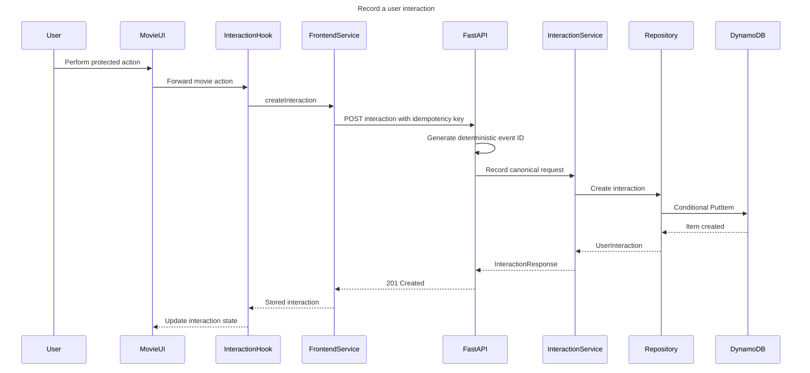
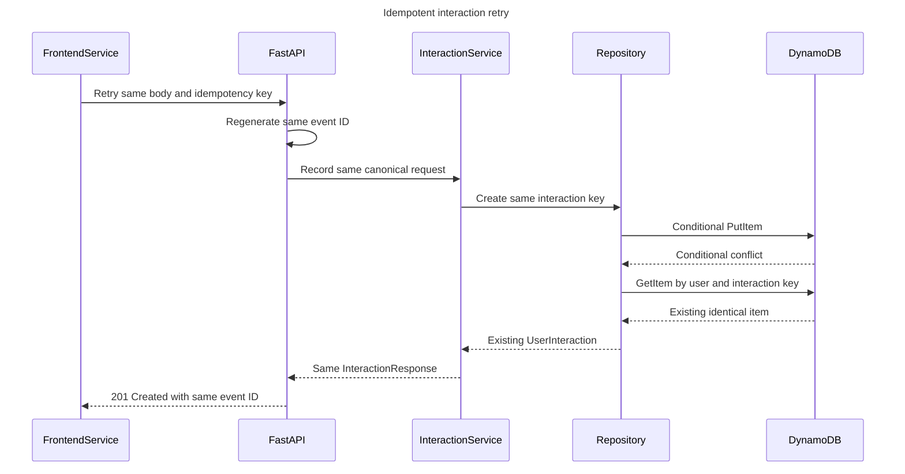

# Interaction Pipeline

## Purpose

The interaction pipeline records user behavior only. It never requests or
calculates recommendations. DynamoDB and future ML export jobs consume the
canonical events independently.

Editable FigJam versions of both sequence diagrams are available in the
[Interaction pipeline board](https://www.figma.com/board/4i9DFePMmbbdOhEdgCzhSg).

Supported interaction types and actions:

| `interaction_type` | Allowed `interaction_action` | `interaction_value` |
|---|---|---|
| `click` | `open_detail` | Optional |
| `watch` | `start`, `progress`, `complete` | Optional non-negative progress value |
| `rating` | `submit` | Required value from 0.5 through 5.0 |
| `reaction` | `like`, `dislike` | Optional |
| `share` | `native_share`, `copy_link` | Optional |

## Canonical record

Every newly persisted item contains:

```text
user_id
interaction_key
event_id
movie_id
interaction_type
interaction_action
interaction_value
timestamp
session_id
```

The sort key is:

```text
timestamp#movie_id#event_id
```

The timestamp is normalized to UTC and rendered with millisecond precision.
The API generates `event_id`; clients cannot provide it.

## Idempotency contract

Clients must send an `Idempotency-Key` header and keep the same request body
when retrying. The request body includes a stable timestamp. At the API
boundary, UUID v5 deterministically derives `event_id` from:

```text
authenticated user_id + Idempotency-Key + canonical request payload
```

This produces the same event ID and interaction key for an identical retry.
`UserInteractionsRepository.create` uses a conditional put. If the item already
exists, the repository reads and returns that identical record. Concurrent or
response-loss retries therefore leave only one DynamoDB item.

## New interaction sequence



## Retry sequence



## Boundaries

- The router owns authentication, idempotency header validation, and event ID
  generation.
- `InteractionService` owns canonical key construction and interaction
  semantics.
- `UserInteractionsRepository` owns DynamoDB operations and retry conflict
  resolution.
- Frontend components only render state and forward user actions.
- `interactionService` is the only frontend module that submits interaction
  requests.
- Recommendation services and providers are not called by this pipeline.
